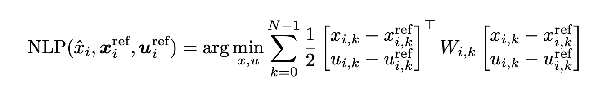
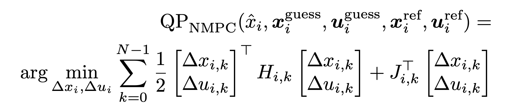
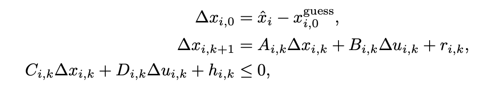
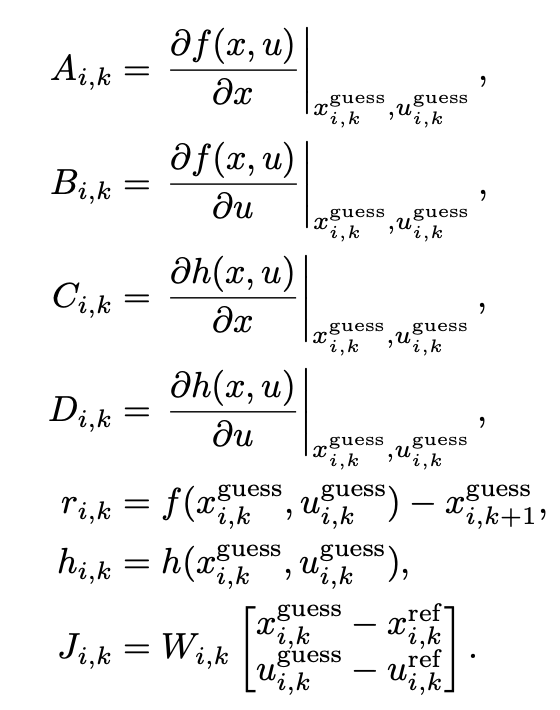

# Nonlinear Model Predictive Control (NMPC) Solver

This repository contains an implementation of a Nonlinear Model Predictive Control (NMPC) solver, utilizing Sequential Quadratic Programming (SQP) and Real-Time Iteration (RTI) algorithms. These algorithms are derived from the work of Gros et al. (2020), which bridges the gap between linear and nonlinear MPC. The purpose of this repository is to demonstrate how to effectively solve a complex NMPC problem using OSQP in Python.

## Background

The NMPC solver is based on the following paper:

**Reference:**
Gros, S., Zanon, M., Quirynen, R., Bemporad, A., & Diehl, M. (2020). From linear to nonlinear MPC: bridging the gap via the real-time iteration. *International Journal of Control, 93*(1), 62-80. [Link to the Paper](https://cse.lab.imtlucca.it/~bemporad/publications/papers/ijc_rtiltv.pdf)

## Inspiration and Design

The original implementation of the NMPCSolver class draws some inspiration from the [MPC class](https://github.com/matssteinweg/Multi-Purpose-MPC/blob/master/src/MPC.py) found in a public repository by Mats Steinweg. However, this solver differs in several important ways:

- **Modularity:** The implementation is highly modular, allowing for easy customization and adaptation to various use cases.
- **General Applicability:** Unlike the referenced implementation, this solver does not assume any specific dynamical model (e.g., vehicle model). It is designed to be general-purpose, capable of handling a wide range of dynamical systems with minimal adaptation.

## Algorithm Details - NMPC and SQP Formulation [Gros et al. (2020)]

**Nonlinear Programming (NLP) Problem:**

Given the state estimate $\hat{x}_i$ and reference trajectories $\boldsymbol{x}_i^{\text{ref}}$ and $\boldsymbol{u}_i^{\text{ref}}$, the optimization problem is:




Subject to:

- Initial state: $x_{i, 0} = \hat{x}_i$
- System dynamics: $x_{i, k+1} = f(x_{i, k}, u_{i, k})$ for $k = 0, \dots, N-1$


**Sequential quadratic programming (SQP) for NMPC**
In the SQP approach, the optimization problem is iteratively approximated by quadratic programming (QP) problems. Each QP provides a Newton direction, guiding steps toward the solution from the current guess. These steps, partial or full, are repeated until convergence.


At a guess $\left(\boldsymbol{x}_i^{\text {guess }}, \boldsymbol{u}_i^{\text {guess }}\right)$, Problem (9) is approximated by the QP:






with 





### Algorithm 1: SQP for NMPC at Discrete Time $i$

**Input:**
- Current state estimate $\hat{x}_i$
- Reference trajectory $(\boldsymbol{x}_i^{\text{ref}}, \boldsymbol{u}_i^{\text{ref}})$
- Initial guess $(\boldsymbol{x}_i^{\text{guess}}, \boldsymbol{u}_i^{\text{guess}})$

**Procedure:**

1. **While** the solution has not converged:
   1. Evaluate $r_{i,k}$, $h_{i,k}$, and the sensitivities $A_{i,k}$, $B_{i,k}$, $C_{i,k}$, $D_{i,k}$, $H_{i,k}$, $J_{i,k}$ using equation (12).
   2. Construct and solve the quadratic program $\text{QP}_{\text{NMPC}}(\hat{x}_i, \boldsymbol{x}_i^{\text{guess}}, \boldsymbol{u}_i^{\text{guess}}, \boldsymbol{x}_i^{\text{ref}}, \boldsymbol{u}_i^{\text{ref}})$ as defined in equation (11) to obtain the Newton direction $(\Delta \boldsymbol{x}_i, \Delta \boldsymbol{u}_i)$.
   3. Update the guess with the Newton step:
      $
      (\boldsymbol{x}_i^{\text{guess}}, \boldsymbol{u}_i^{\text{guess}}) \leftarrow (\boldsymbol{x}_i^{\text{guess}}, \boldsymbol{u}_i^{\text{guess}}) + \alpha (\Delta \boldsymbol{x}_i, \Delta \boldsymbol{u}_i)
      $

2. **End While**

**Output:**
- NMPC solution $(x_i, u_i) = (\boldsymbol{x}_i^{\text{guess}}, \boldsymbol{u}_i^{\text{guess}})$

# Implementation Details - How to use the NMPCSolver Class

## Overview

The `NMPCSolver` class is designed to work with any system that can be described by the `MPCModel` abstract class. It uses the OSQP (Operator Splitting Quadratic Program) solver for optimization.

## TODO List

- [ ] **Implement State Constraints**
  - [ ] Implement Linear State Constraints
  - [ ] Implement Nonlinear State Constraints

- [ ] **Implement Control Constraints**
  - [X] Implement Linear Control Constraints
  - [ ] Implement Nonlinear Control Constraints

- [ ] **Implement Non-Quadratic Cost functions**


# NMPC Solver - How to use

## Initialization

To create an NMPC (Nonlinear Model Predictive Control) solver, instantiate the `NMPCSolver` class with the following parameters:

solver = NMPCSolver(model, N, Q, R, state_constraints, input_constraints)

### Parameters:

- **`model`**: An instance of a class derived from `MPCModel`. This class should implement the required methods for the NMPC solver to function properly.
- **`N`**: The prediction horizon as an integer, specifying the number of future time steps the solver will consider.
- **`Q`**: State cost matrix, which defines the cost associated with the state deviations.
- **`R`**: Input cost matrix, which defines the cost associated with the control inputs.
- **`state_constraints`**: A dictionary defining constraints on the state variables.
- **`input_constraints`**: A dictionary defining constraints on the control inputs.

## MPCModel Interface

To use the `NMPCSolver`, you must implement a model class that inherits from `MPCModel` and provides the following methods:

- **`linearization_model(state, inp, reference_state, reference_input)`**: Provides the linearized model around a given state and input. This is used by the `MPCSolver` for linearization-based control.
- **`step_nonlinear_model(state, inp)`**: Implements the discrete-time nonlinear model of the system.
# NMPC Solver

## Initialization

To create an NMPC (Nonlinear Model Predictive Control) solver, instantiate the `NMPCSolver` class with the following parameters:

solver = NMPCSolver(model, N, Q, R, state_constraints, input_constraints)

### Parameters:

- **`model`**: An instance of a class derived from `MPCModel`. This class should implement the required methods for the NMPC solver to function properly.
- **`N`**: The prediction horizon as an integer, specifying the number of future time steps the solver will consider.
- **`Q`**: State cost matrix, which defines the cost associated with the state deviations.
- **`R`**: Input cost matrix, which defines the cost associated with the control inputs.
- **`state_constraints`**: A dictionary defining constraints on the state variables.
- **`input_constraints`**: A dictionary defining constraints on the control inputs.

## MPCModel Interface

To use the `NMPCSolver`, you must implement a model class that inherits from `MPCModel` and provides the following methods:

- **`step_nonlinear_model(state, inp)`**: Implements the discrete-time nonlinear model of the system.

- **`linearization_model(state, inp, reference_state, reference_input)`**: Provides the linearized model of the discrete-tume nonlinear model of the system.

- **`nonlinear_model(state, inp)`**: Defines the nonlinear (continuous time) vector field. Not directly used by the `MPCSolver`, this method is useful for simulating the system dynamics.

- **`output_model(state, inp)`**: Defines the output model. Currently not used by the `MPCSolver`, will be used in future extensions.


### Solving the NMPC Problem

To solve the NMPC problem, use the `solve_sqp` method:

```python
X_optimal, U_optimal = solver.solve_sqp(current_state, X_ref, U_ref, X_guess=None, U_guess=None, debug=False, sqp_iter=1, alpha=1.0)
```

Parameters:
- `current_state`: The current state of the system
- `X_ref`: Reference state trajectory
- `U_ref`: Reference input trajectory
- `X_guess`: Initial guess for state prediction
- `U_guess`: Initial guess for input sequence
- `debug`: Boolean flag for debug mode (default: False)
- `sqp_iter`: Number of SQP iterations (default: 1)
- `alpha`: Step size parameter (default: 1.0)

Returns:
- `X_optimal`: Optimal state trajectory
- `U_optimal`: Optimal input trajectory


## `solve_sqp` Method Overview

### Initialization
- If no initial guesses are provided for states and controls, the method initializes them using the values computed at the previous time step (if available) or the reference values (if no other guess is available).

### Iterative Optimization
For each SQP iteration:
- Updates linearization matrices based on the current guess.
- Constructs the equality and inequality constraint matrices.
- Solves the quadratic programming problem using OSQP.
- Updates the state and control guesses.

### Debugging
- If debugging is enabled, saves and plots the evolution of state and control guesses.

### Update and Return
- Updates the current control and prediction with the final guesses.
- Returns the optimized state and control trajectories.

An example of the SQP solver in use is provided in .
