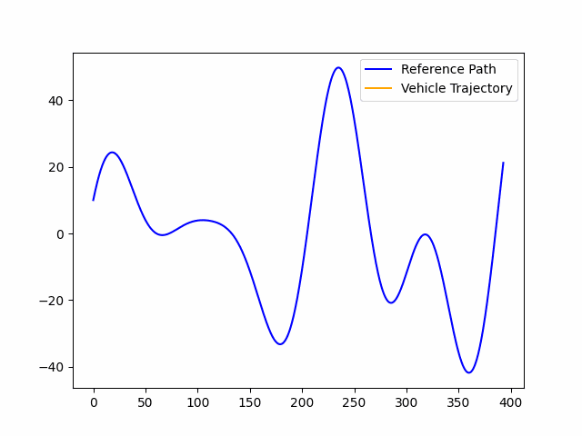

# Nonlinear Model Predictive Control (NMPC) Solver

This repository contains an implementation of a Nonlinear Model Predictive Control (NMPC) solver, utilizing Sequential Quadratic Programming (SQP) and Real-Time Iteration (RTI) algorithms as presented in the following paper:

Gros, S., Zanon, M., Quirynen, R., Bemporad, A., & Diehl, M. (2020). From linear to nonlinear MPC: bridging the gap via the real-time iteration. *International Journal of Control, 93*(1), 62-80. [Link to the Paper](https://cse.lab.imtlucca.it/~bemporad/publications/papers/ijc_rtiltv.pdf)

An example of the NMPC solver in use is provided in the Path Follower [example notebook](vehicle_dynamics/path_following_example.ipynb), for the path following and velocity control of a simple vehicle modelled with a kinematic bicycle. Below is an animation showing the MPC controller in action for path following and velocity tracking.




 Additional examples of use of the NMPC solver are currently under development.

# Implementation Details

## Inspiration and Design

The implementation of the NMPCSolver class draws some inspiration from the [Linear MPC class](https://github.com/matssteinweg/Multi-Purpose-MPC/blob/master/src/MPC.py) found in a public repository by Mats Steinweg. Compared to the former, this solver does not assume any specific dynamical model (e.g., vehicle model). It is designed to be general-purpose, capable of handling a wide range of dynamical systems with minimal adaptation.
Furthermore, the solver developed in this repository uses an SQP implementation for the solution of the NMPC problem. For more details on the Nonlinear MPC formulation, see the [Algorithm Details](##algorithm-details---nmpc-and-sqp-formulation) section.


## Overview

The `NMPCSolver` class is designed to work with any system that can be described by the `MPCModel` abstract class. It uses the OSQP (Operator Splitting Quadratic Program) solver for the optimization at each SQP step. [NMPCSolver class definition](nonlinearmpcsolver.py)

# NMPC Solver - How to use

## MPCModel Interface

To use the `NMPCSolver`, you must implement a model class that inherits from `MPCModel` with the following methods implemented:

- [REQUIRED] **`step_nonlinear_model(state, inp)`**: Implements the discrete-time nonlinear model of the system.

- [REQUIRED] **`linearization_model(state, inp)`**: Provides the linearized model of the discrete-time nonlinear model of the system.

- **`nonlinear_model(state, inp)`**: Defines the nonlinear (continuous time) vector field. Not directly used by the `MPCSolver`, this method is useful for simulating the system's dynamics.


## Initialization

To create an NMPC (Nonlinear Model Predictive Control) solver, instantiate the `NMPCSolver` class with the following parameters:

solver = NMPCSolver(model, N, Q, R, state_constraints, input_constraints)

### Parameters:

- **`model`**: An instance of a class derived from `MPCModel`. 
- **`N`**: The number of prediction steps.
- **`Q`**: State cost matrix, defines the cost associated with the state deviations.
- **`R`**: Input cost matrix, defines the cost associated with the control inputs.
- **`state_constraints`**: A dictionary defining constraints on the state variables.
- **`input_constraints`**: A dictionary defining constraints on the control inputs.


### Solving the NMPC Problem

To solve the NMPC problem, use the `solve_sqp` method:

```python
X_optimal, U_optimal = solver.solve_sqp(current_state, X_ref, U_ref, X_guess=None, U_guess=None, debug=False)
```

Parameters:
- `current_state`: The current state of the system
- `X_ref`: Reference state trajectory
- `U_ref`: Reference input trajectory
- `X_guess`: Initial guess for state prediction
- `U_guess`: Initial guess for input sequence
- `debug`: Boolean flag for debug mode (default: False)

Returns:
- `X_optimal`: Optimal state trajectory
- `U_optimal`: Optimal input trajectory

## `solve_sqp` Method Overview

### Initialization
- If no initial guesses are provided for states and controls, the method initializes them using the shifted values computed at the previous time step (if available) or the reference values (if no other guess is provided).

### Iterative Optimization
For each SQP iteration:
- Updates linearization matrices based on the current guess.
- Constructs the equality and inequality constraint matrices.
- Solves the quadratic programming problem using OSQP.
- Updates the state and control guesses.

### Debugging
- If debugging is enabled, saves and plots the evolution of state and control guesses.

### Update and Return
- Updates the current control and prediction with the final guesses.
- Returns the optimized state and control trajectories.


## TODO List

The following features are currently under development.

- [ ] **Implement State Constraints**
  - [ ] Implement Linear State Constraints
  - [ ] Implement Nonlinear State Constraints

- [ ] **Implement Control Constraints**
  - [X] Implement Linear Control Constraints
  - [ ] Implement Nonlinear Control Constraints

- [ ] **Implement Non-Quadratic Cost functions**


## Algorithm Details - NMPC and SQP Formulation
_The following is from Gros et al. (2020), reported here for convenience._ 
 
**Nonlinear Programming (NLP) Problem:**

Given the state estimate $\hat{x}_i$ and reference trajectories $\boldsymbol{x}_i^{\text{ref}}$ and $\boldsymbol{u}_i^{\text{ref}}$, the optimization problem is:


```math
\text{NLP}(\hat{x}_i, \mathbf{x}_i^{\text{ref}}, \mathbf{u}_i^{\text{ref}}) = \arg\min_{x, u} \sum_{k=0}^{N-1} \frac{1}{2} \begin{bmatrix} x_{i,k} - x_{i,k}^{\text{ref}} \\ u_{i,k} - u_{i,k}^{\text{ref}} \end{bmatrix}^\top W_{i,k} \begin{bmatrix} x_{i,k} - x_{i,k}^{\text{ref}} \\ u_{i,k} - u_{i,k}^{\text{ref}} \end{bmatrix}
```


Subject to:

- Initial state: $x_{i, 0} = \hat{x}_i$
- System's dynamics: $x_{i, k+1} = f(x_{i, k}, u_{i, k})$ for $k = 0, \dots, N-1$


**Sequential quadratic programming (SQP) for NMPC**

In the SQP approach, the optimization problem is iteratively approximated by quadratic programming (QP) problems. Each QP provides a Newton direction, guiding steps toward the solution from the current guess. These steps, partial or full, are repeated until convergence.


At a guess $\left(\boldsymbol{x}_i^{\text {guess }}, \boldsymbol{u}_i^{\text {guess }}\right)$, Problem (9) is approximated by the QP:


### Algorithm 1: SQP for NMPC at Discrete Time $i$

**Input:**
- Current state estimate $\hat{x}_i$
- Reference trajectory $(\boldsymbol{x}_i^{\text{ref}}, \boldsymbol{u}_i^{\text{ref}})$
- Initial guess $(\boldsymbol{x}_i^{\text{guess}}, \boldsymbol{u}_i^{\text{guess}})$

**Procedure:**

1. **While** the solution has not converged:
   1. Evaluate $r_{i,k}$, $h_{i,k}$, and the sensitivities $A_{i,k}$, $B_{i,k}$, $C_{i,k}$, $D_{i,k}$, $H_{i,k}$, $J_{i,k}$.
   2. Construct and solve the quadratic program $\text{QP}_{\text{NMPC}}(\hat{x}_i, \boldsymbol{x}_i^{\text{guess}}, \boldsymbol{u}_i^{\text{guess}}, \boldsymbol{x}_i^{\text{ref}}, \boldsymbol{u}_i^{\text{ref}})$ to obtain the Newton direction $(\Delta \boldsymbol{x}_i, \Delta \boldsymbol{u}_i)$.
   3. Update the guess with the Newton step:
      $(\boldsymbol{x}_i^{\text{guess}}, \boldsymbol{u}_i^{\text{guess}}) \leftarrow (\boldsymbol{x}_i^{\text{guess}}, \boldsymbol{u}_i^{\text{guess}}) + \alpha (\Delta \boldsymbol{x}_i, \Delta \boldsymbol{u}_i)$

2. **End While**

**Output:**
- NMPC solution $(x_i, u_i) = (\boldsymbol{x}_i^{\text{guess}}, \boldsymbol{u}_i^{\text{guess}})$
